# RegChain Core: RWA Compliance Engine

## Overview
RegChain Core is a smart contract framework for Real World Asset (RWA) compliance and on-chain audit reporting. It demonstrates how role-based authorization, blockchain-based audit records, and decentralized document references can support transparent compliance workflows for tokenized assets.

## Motivation
As tokenized Real World Assets (RWAs) become increasingly adopted, transparent compliance and auditability are essential for institutional blockchain applications.
RegChain demonstrates how role-based authorization and on-chain audit records can support compliance processes while keeping detailed documentation off-chain via IPFS.

## Protocol Flow
1. A Compliance Officer records a compliance report.
2. The report stores jurisdiction, risk score, approval status, and an IPFS document reference.
3. Authorized auditors retrieve and review the compliance record.
4. External applications verify the audit information directly from the blockchain.

## System Architecture

```mermaid
flowchart LR
    %% Actors
    CO["👤 Compliance Officer<br/><span style='font-size:12px'>Creates and manages reports</span>"]
    AU["🔎 Authorized Auditor<br/><span style='font-size:12px'>Reviews compliance records</span>"]
    DAPP["🔗 External dApps<br/><span style='font-size:12px'>Verify asset eligibility</span>"]

    %% Core contract
    subgraph CORE["RegChain Core — Smart Contract Layer"]
        direction TB
        AC["Role-Based Authorization<br/><span style='font-size:12px'>OpenZeppelin AccessControl</span>"]
        CR["Compliance Report Registry<br/><span style='font-size:12px'>Jurisdiction · Risk Score · Status</span>"]
        EL["Event-Based Audit Logging<br/><span style='font-size:12px'>Transparent on-chain activity</span>"]
        IR["IPFS Reference Management<br/><span style='font-size:12px'>Document metadata hashes</span>"]

        AC --> CR
        CR --> EL
        CR --> IR
    end

    %% Infrastructure
    ETH[("⛓️ Ethereum Sepolia<br/><span style='font-size:12px'>On-chain compliance records</span>")]
    IPFS[("📄 IPFS<br/><span style='font-size:12px'>Off-chain audit documentation</span>")]

    %% Main workflow
    CO -->|"Authorized transaction"| AC
    CR -->|"Stores structured report"| ETH
    IR -->|"References document hash"| IPFS

    ETH -->|"Reads and verifies"| AU
    IPFS -.->|"Retrieves supporting files"| AU

    ETH -->|"Compliance status query"| DAPP
    DAPP -.->|"Optional document retrieval"| IPFS

    %% Styling
    classDef actor fill:#111827,stroke:#38bdf8,stroke-width:2px,color:#f8fafc;
    classDef core fill:#172033,stroke:#818cf8,stroke-width:2px,color:#f8fafc;
    classDef chain fill:#102a2e,stroke:#2dd4bf,stroke-width:2px,color:#f8fafc;
    classDef storage fill:#2a1f3d,stroke:#c084fc,stroke-width:2px,color:#f8fafc;

    class CO,AU,DAPP actor;
    class AC,CR,EL,IR core;
    class ETH chain;
    class IPFS storage;

    style CORE fill:#0f172a,stroke:#64748b,stroke-width:1.5px,color:#f8fafc
```

### Architecture Summary

RegChain separates structured compliance data from detailed audit documentation:

- **Ethereum Sepolia** stores verifiable compliance records, authorization logic, and audit events.
- **IPFS** provides decentralized references to supporting compliance documents.
- **OpenZeppelin AccessControl** restricts report management and review operations to authorized roles.
- **External applications** can query on-chain records to evaluate the compliance status of tokenized assets.

## Deployment
The contract is deployed and verified on the Ethereum Sepolia Testnet.

* **Contract Address:** [0x8c66419d3b68dd2ade365627e0e6a15229bca628](https://sepolia.etherscan.io/address/0x8c66419d3b68dd2ade365627e0e6a15229bca628)

## Key Features
- **Role-Based Access Control (RBAC):** Built on OpenZeppelin AccessControl to manage Compliance Officer and Auditor permissions.
- **On-Chain Audit Records:** Stores compliance reports including jurisdiction, risk score, approval status, and IPFS document references.
- **Transparent Compliance Logging:** All compliance events are recorded on-chain and can be independently verified.

## Technical Architecture

- **Framework:** Foundry (Forge)
- **Language:** Solidity 0.8.20
- **Security:** OpenZeppelin AccessControl
- **Storage:** On-chain compliance records with IPFS document references
- **Network:** Ethereum Sepolia Testnet

## Test Coverage

The project includes automated Foundry tests covering:

- Role-based access control
- Compliance report creation
- Risk score evaluation
- Audit record retrieval

## Developer Guide

### 1. Installation & Setup
Clone the repository and install all necessary dependencies with these commands:

### Clone the project
git clone https://github.com/BlockchainInes/regchain-compliance-engine.git

cd regchain-compliance-engine

### Install OpenZeppelin Contracts
forge install OpenZeppelin/openzeppelin-contracts

### Build the project
forge build

### 2. Quality Assurance (Testing)
Automated Foundry tests are provided to verify the core contract functionality.

### Run all tests
forge test

### Run tests with gas report for optimization analysis
forge test --gas-report

### 3. Deployment & Verification
To deploy the contract to the Sepolia network, ensure your .env file is set up correctly (refer to .env.example).

### Deploy and verify on Etherscan using environment variables
forge create contracts/RegChainCore.sol:RegChainCore --rpc-url $env:RPC_URL --private-key $env:PRIVATE_KEY --etherscan-api-key $env:ETHERSCAN_API_KEY --verify --broadcast

## Author
* **Project Lead:** Ines Krueger

## License
This project is licensed under the MIT License.
